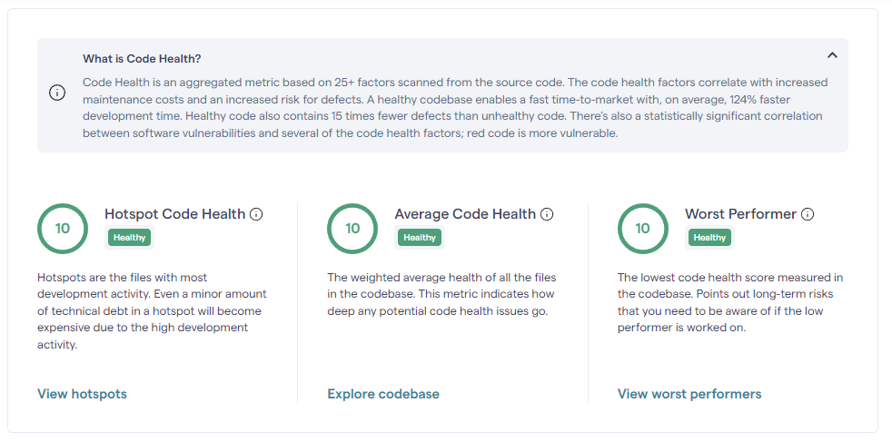
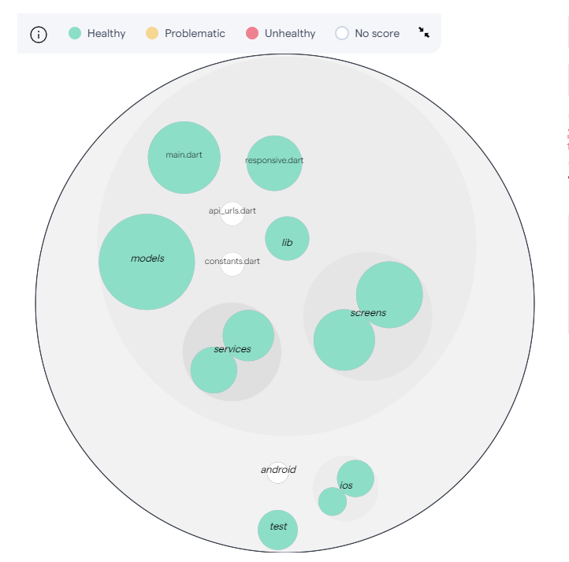

# Flutter Boilerplate

A comprehensive Flutter template showcasing best practices, including pre-built pages, Provider integration, and HTTP handling, enabling developers to kickstart their Flutter projects with ease.

> **Note:** This project is still under development.

## Getting Started

To get started with Flutter Boilerplate, follow these steps:

1. Clone the repository: `git clone https://github.com/mehmet-karagoz/flutter-boilerplate.git`
2. Navigate to the project directory: `cd flutter-boilerplate`
3. Install dependencies: `flutter pub get`
4. Run the app: `flutter run`

## Features

- Ready-made pages for quick integration.
- Provider integration for state management.
- HTTP handling for making API requests.

## Contributing

Contributions are welcome! If you would like to contribute to this project, please follow these steps:

1. Fork the repository.
2. Create a new branch for your feature: `git checkout -b feature-name`
3. Make your changes and commit them: `git commit -am 'Add new feature'`
4. Push to the branch: `git push origin feature-name`
5. Submit a pull request.

Please make sure to follow our [Contributing Guidelines](CONTRIBUTING.md) and adhere to our [Code of Conduct](CODE_OF_CONDUCT.md) to maintain a respectful and inclusive community.

## Support

If you find this project helpful and would like to support its development, here are a few ways you can contribute:

- Star the repository: 
- Fork the repository: 
- Report issues: 
- Submit pull requests: 

## License

This project is licensed under the MIT License - see the [LICENSE](LICENSE) file for details.
